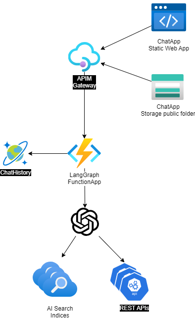
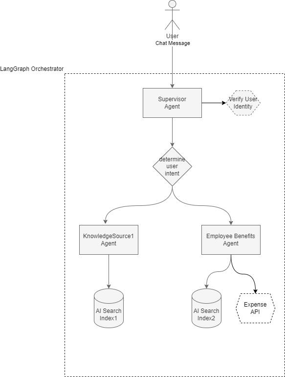

# Agentic Generative AI Example - Python and LangChain Backend

## Features
- Front End Client:
	- Natural language chat UI and AI generative answers
- Back End API:
	- HTTP triggered function to process 
  - Langchain powered agentic orchestration or direct tool calling (controllable by USE_SUPERVISOR environment variable)


## Application Architecture




- **User Interface**:  The application's chat interface is a react/js web application hosted as a [Static Web App](https://azure.microsoft.com/en-us/products/app-service/static). This interface is what accepts user messages and questions, routes request to the application backend, and displays generated responses.
	- This was originally based on the sample front end found in [Sample Chat App with AOAI - GitHub](https://github.com/microsoft/sample-app-aoai-chatGPT) 
  - This could be fronted by an APIM gateway for additional security and management capabilities. 
- **Backend**: 
	- A [Python Azure Function](https://learn.microsoft.com/en-us/azure/azure-functions/functions-reference-python?tabs=get-started%2Casgi%2Capplication-level&pivots=python-mode-decorators) that processes requests from the front end and routes them to the Azure OpenAI service. This is hosted in an Azure Function App, with the option of storing history in a DB like Cosmos DB.
  	- [Langchain](https://python.langchain.com/v0.2/docs/introduction/) - builds and orchestrates the agents, RAG pattern completion between the services, and API actions while managing chat history and other capabilities.
    - [Azure OpenAI Service](https://learn.microsoft.com/azure/search/search-what-is-azure-search) - provides the Large Language Models to generate responses and for vectorization when needed.
    - Various tools can provide connectivity to knowledge. These can include search indices or other custom-purpose APIs.

- **Basic Logical Flow**:



# Getting Started

## Account Requirements
In order to deploy and run this example, you'll need
- **Azure Account** - If you're new to Azure, get an [Azure account for free](https://aka.ms/free) and you'll get some free Azure credits to get started.
- **Azure subscription with access enabled for the Azure OpenAI service** - [You can request access](https://aka.ms/oaiapply). 
- **Azure account permissions** - Your Azure Account must have `Microsoft.Authorization/roleAssignments/write` permissions, such as [User Access Administrator](https://learn.microsoft.com/azure/role-based-access-control/built-in-roles#user-access-administrator) or [Owner](https://learn.microsoft.com/azure/role-based-access-control/built-in-roles#owner).


## Cost estimation

Pricing varies per region and usage, so it isn't possible to predict exact costs for your usage. However, you can try the [Azure pricing calculator](https://azure.microsoft.com/pricing/calculator/) for the resources below:
- [**Azure Functions**](https://azure.microsoft.com/en-us/pricing/details/functions/)
- [**Azure OpenAI Service**](https://azure.microsoft.com/pricing/details/cognitive-services/openai-service/)
- [**Azure Blob Storage**](https://azure.microsoft.com/pricing/details/storage/blobs/)
- [**Azure Monitor**](https://azure.microsoft.com/pricing/details/monitor/)


## Deployment
This project supports `azd` for easy deployment of the complete application, as defined in the main.bicep resources.  
See [Deployment Instructions here](./infra/README.md).


## Running locally for Dev and Debug
As cloud resources are required to run the client app and minimal API even locally, manual creation of an Azure OpenAI service is required (automatic deployment TBD as mentioned in the `Deployment` section above). You can then configure your local user secrets to point to those required cloud resources before building and running locally for the purposes of debugging and development.

**Prerequisites:**
The following tooling is required on your local dev environment:
- VS Code
- [Static Web Apps CLI](https://azure.github.io/static-web-apps-cli/)
- [Azure Functions - Core Tools](https://learn.microsoft.com/en-us/azure/azure-functions/functions-run-local?tabs=macos%2Cisolated-process%2Cnode-v4%2Cpython-v2%2Chttp-trigger%2Ccontainer-apps&pivots=programming-language-python#v2)
- [Vite front-end tooling](https://vitejs.dev/)
- [TypeScript language support](https://www.typescriptlang.org/)
- Various NPM packages can help facilicate the prereqs...
    ```
    npm install -g vite
    npm install -g typescript
    npm install -g @azure/static-web-apps-cli
    ```


**Required cloud resources:**
- Azure OpenAI Service
	- chat model

### Running the Backend Locally
Ensure that you have provisioned your Azure OpenAI service. Place a .env file in the src/bakend directory with the following variables that reference the service:
```
AZURE_OPENAI_ENDPOINT=""
AZURE_OPENAI_API_VERSION=""
AZURE_OPENAI_API_DEPLOYMENT_NAME=""
AZURE_OPENAI_API_KEY=""
USE_SUPERVISOR="True"
```

Within VS Code, press `F5` or `Run` > `Start Debugging`. This should open a terminal and when finished, should show logs similar to the following:

```
[2024-08-15T14:20:58.092Z] Worker process started and initialized.

Functions:

        converse: [POST] http://localhost:7071/api/conversation

        runFrontendSettings: [GET] http://localhost:7071/api/frontend_settings

        runHealthCheck: [GET] http://localhost:7071/api/health

        runTestChatBp: [POST] http://localhost:7071/api/test-chat

For detailed output, run func with --verbose flag.
```

Your backend Function App is now accepting traffic at the above URLs.

To stop the backend, just kill the terminal that it is running in.

### Running the Frontend Locally
First, ensure that your backend is running. See `Running the Backend Locally` above. 
- Open your VS Code [Command Pallete](https://code.visualstudio.com/docs/getstarted/userinterface#_command-palette) (`F1` or `Ctrl+Shift+P` or `Shift+Command+P` on a Mac)
- Choose `Tasks: Run Task`
- Choose `SWA Start (against running functions)`

This will open a second terminal and start logging requests as the browser downloads packages. You can ignore the port unavailable error. This will be fixed in a future task.

```
Found Python version 3.11.5 (python).
Port 7071 is unavailable. Close the process using that port, or specify another port using --port [-p].

Found configuration file:
  C:\code\code-with\intuitive\chiron\src\frontend\staticwebapp.config.json

⠏ Waiting for http://localhost:5173 to be ready
> frontend@0.0.0 dev
> vite

  VITE v5.4.0  ready in 1027 ms

  ➜  Local:   http://localhost:5173/
  ➜  Network: http://192.168.2.80:5173/
  ➜  Network: http://192.168.196.112:5173/
  ➜  Network: http://172.28.96.1:5173/
  ➜  Network: http://172.20.160.1:5173/
  ➜  Network: http://192.168.128.1:5173/
  ➜  press h + enter to show help
✔ http://localhost:5173 validated successfully
✔ http://localhost:7071 validated successfully

Using dev server for static content:
  http://localhost:5173

Serving API:
  C:\code\code-with\intuitive\chiron\src\backend

Azure Static Web Apps emulator started at http://localhost:4280. Press CTRL+C to exit.

GET http://localhost:5173/ (proxy)
GET http://localhost:4280/ - 204
GET http://localhost:5173/ (proxy)
GET http://localhost:4280/ - 200
...
```

This should open a browser, pointing to https://localhost:4280 with a basic chat UI.

To stop the frontend, just kill the terminal that it is running in.


# Contributing

This project welcomes contributions and suggestions.  Most contributions require you to agree to a
Contributor License Agreement (CLA) declaring that you have the right to, and actually do, grant us
the rights to use your contribution. For details, visit https://cla.opensource.microsoft.com.

When you submit a pull request, a CLA bot will automatically determine whether you need to provide
a CLA and decorate the PR appropriately (e.g., status check, comment). Simply follow the instructions
provided by the bot. You will only need to do this once across all repos using our CLA.

This project has adopted the [Microsoft Open Source Code of Conduct](https://opensource.microsoft.com/codeofconduct/).
For more information see the [Code of Conduct FAQ](https://opensource.microsoft.com/codeofconduct/faq/) or
contact [opencode@microsoft.com](mailto:opencode@microsoft.com) with any additional questions or comments.

## Trademarks

This project may contain trademarks or logos for projects, products, or services. Authorized use of Microsoft 
trademarks or logos is subject to and must follow 
[Microsoft's Trademark & Brand Guidelines](https://www.microsoft.com/en-us/legal/intellectualproperty/trademarks/usage/general).
Use of Microsoft trademarks or logos in modified versions of this project must not cause confusion or imply Microsoft sponsorship.
Any use of third-party trademarks or logos are subject to those third-party's policies.